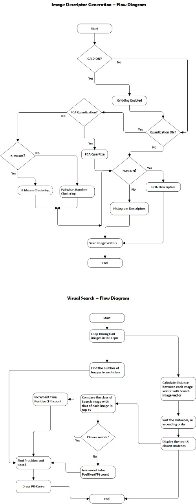
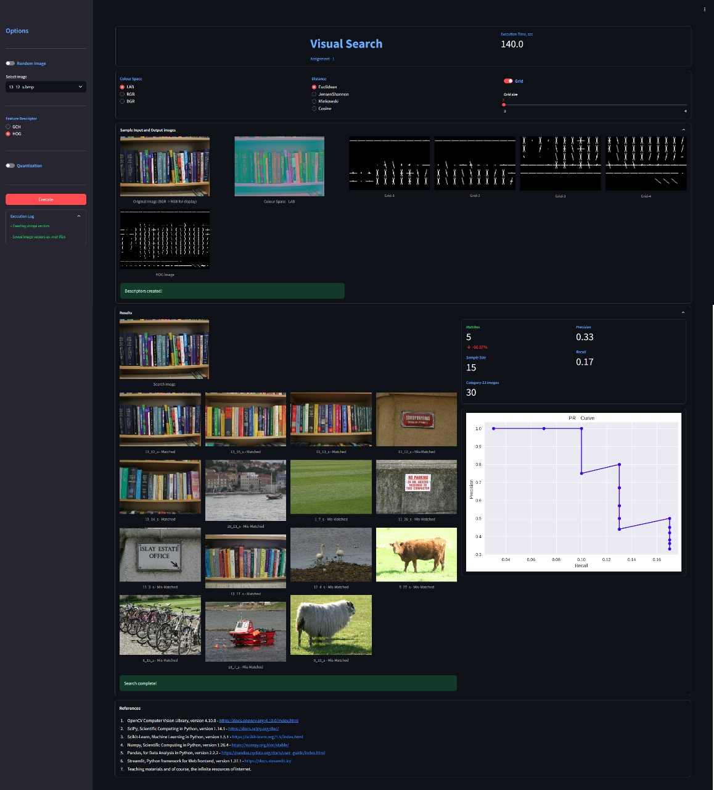

## Visual Search

The **Visual Search** application, developed utilizing Streamlit, has been designed to meet the requirements of Assignment-1 in _Computer Vision and Pattern Recognition_ class. This tool enables users to perform image searches based on a reference image, leveraging various techniques and providing insights into search performance through metrics such as _precision_, _recall_, and _precision-recall (PR) curve_.

## Libraries Used

1. OpenCV Computer Vision Library, version 4.10.0 - https://docs.opencv.org/4.10.0/index.html
2. SciPy, Scientific Computing in Python, version 1.14.1 - https://docs.scipy.org/doc/
3. Scikit-Learn, Machine Learning in Python, version 1.5.1 - https://scikit-learn.org/1.5/index.html
4. Numpy, Scientific Computing in Python, version 1.26.4 - https://numpy.org/doc/stable/
5. Pandas, for Data Analysis in Python, version 2.2.2 - https://pandas.pydata.org/docs/user_guide/index.html
6. Streamlit, Python framework for Web frontend, version 1.37.1 - https://docs.streamlit.io/
7. Matplotlib, Visualization with Python, version 3.9.2 - https://matplotlib.org/stable/index.html

## Requirements

1. Platform - Ubuntu 24.04 on Windows 11 WSL2.
   - With minor modifications, the App can be run on Windows 11 also.
2. Language - Python - 3.11.6

## Installation Instructions

All libraries can be installed either using **conda** or **pip**. To avoid library mis-match, it is recommened to use **conda** where possible.

**Example**:

> _**conda install anaconda::pandas or pip install pandas**_

## Usage Instructions

1. Ubuntu 24.04 on Windows 11 WSL2.
   - Open Windows terminal
     - run **wsl**, you will now have access to Linux terminal.
     - go to the directory where the App is located and execute,
       > _**streamlit run cvpr_computedescriptors_Streamlit.py**_
     - To run the App in background, so that the terminal can be re-used, execute as
       > _**streamlit run cvpr_computedescriptors_Streamlit.py &**_
     - The App will automatically open up in the default browser. If NOT, **copy - paste** the URL provided, in the browser to access the App.
2. Windows
   - Open Windows terminal
     - go to the directory where the App is and execute,
       > _**streamlit run cvpr_computedescriptors_Streamlit.py**_
     - The App will automatically open up in the default browser. If NOT, **copy - paste** the URL provided, in the browser to access the App.
3. VS Code
   - Connect to _**WSL**_
   - Click on _**Terminal -> New Terminal**_
   - A terminal window will be open at the bottom.
     - In the terminal, go to the directory where the App is and execute,
       > _**streamlit run cvpr_computedescriptors_Streamlit.py**_
     - The App will automatically open up in the default browser. If NOT, **copy - paste** the URL provided, in the browser to access the App.

The App is self intutive and the user can run various combinations of input parameters to check the results and stats.

- To run PCA based Visual search, execute the below command:

  > _**streamlit run cvpr_computedescriptors_PCA_Streamlit.py**_

- To run SIFT and ORB based Visual search, execute the below command:

  > _**streamlit run cvpr_computedescriptors_Advanced_Streamlit.py**_

- To run BoVW based Visual search, execute the below command:

  > _**streamlit run cvpr_computedescriptors_BoVW.py**_

**_Note_**: The App was developed on Windows 11 WSL running Ubuntu 24.04 LTS.

## User Options

The web front-end provides the user with various combinations of options, allowing them to execute and analyze various scenarios.

1. Random Image
   - If enabled, a random image is choosen as search image.
   - If not, the user can choose any image from the listed.
2. Feature Descriptor
   - The user can choose between either of the below 2:
     - Global Colour Histogram (GCH)
     - Histogram of Oriented Gradients (HOG)
3. Quantization
   - Options available are:
     - K-Means, You can vary the _Q values_ to get different outcomes.
     - Random, Pair-wise, You can vary the _Q values_ to get different outcomes.
4. Colour Space
   - Options available, to choose from, are:
     - LAB - a three-dimensional model that encapsulates Lightness (L) and two color-opponent dimensions: Green-Red (A) and Blue-Yellow (B).
     - RGB - a three-dimensional model that expresses colors as a combination of red (R), green (G), and blue (B) values.
     - BGR - a three-dimensional model that expresses colors as a combination of blue (B), green (G), and red (R) values.
5. Distance
   - Available options are:
     - Euclidean
     - JensenShannon
     - Minkowski
     - Cosine
     - Mahalanobis (_only for PCA_)
6. Grid
   - Gridding can be enables or not.
     - Available options for gridding are:
       - kSize = 2, gives 4 grids
       - kSize = 3, gives 9 grids
       - kSize = 4, gives 16 grids

**Note**: Except when _**Random Image**_ is selected, do make sure to click on the _Execute button_ to run the App.

## Project Structure

```bash
.
├── cvpr_compare_v3.py
├── cvpr_computedescriptors_Advanced_Streamlit.py (Generates Image Vectors with SIFT & ORB)
├── cvpr_computedescriptors_BoVW.py (Generates Image Frequency Vectors with SIFT and ORB for Bag of Visual Words)
├── cvpr_computedescriptors_PCA_Streamlit.py (Generates PCA image vectors)
├── cvpr_computedescriptors_Streamlit.py (Generates Image Vectors with GCH & HOG)
├── cvpr_visualsearch_v3.py (Script to perform Visual Search)
├── descriptors
│   └── globalRGBhisto
├── extractRandom_v3.py (Generates Image Vector for input image)
├── HelperFunctions.py (Helper functions to aid in the over-all computations)
├── MSRC_ObjCategImageDatabase_v2
│   ├── Images
│   └── PCA
├── README.md
├── README.txt
|── Visual_Search_Flowchart.png
└── Visual_Search_Screenshot.png

```

## Visuals

### Flowchart



### Screen Shot



## Acknowledgments

This work is based on the teaching materials, books, videos and available documentation, online.

## Author

| Name              | Email                | Class                                                          |
| ----------------- | -------------------- | -------------------------------------------------------------- |
| Vishal Ranganatha | vr00353@surrey.ac.uk | 1st Semeter, MSc Artificial Intelligence, University of Surrey |
